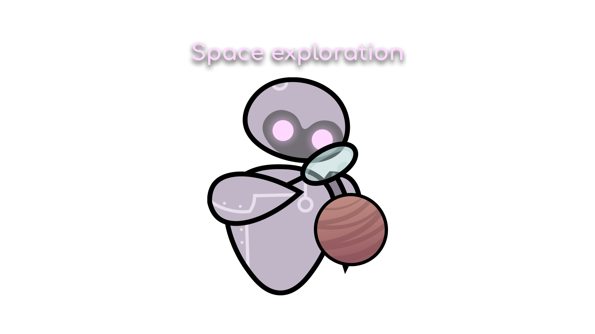
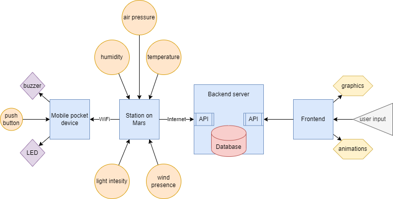
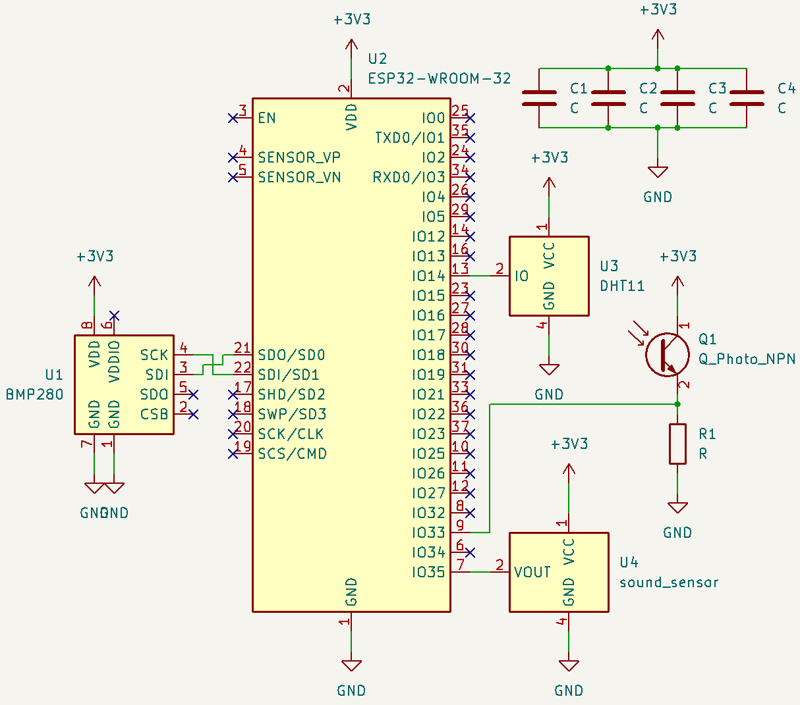
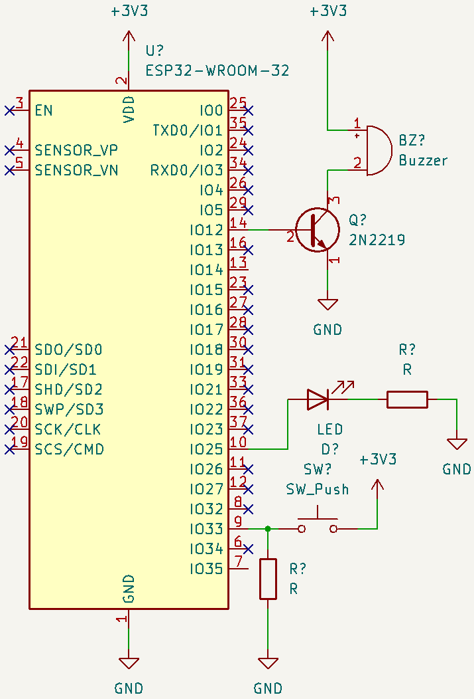

# *СПИМ* - Система за Подпомагане Изследването на Марс

*Този проект е създаден за училищния хакатон Hack TUES Infinity
с главна тема Space for everybody и задача за разработка на решение,
свързано с космоса, космологията или космонавтиката.*

*Подтемата, към която принадлежи проекта, е Space exploration със задача
да се разработи решение, подпомагащо изследването на космически обекти.*
## Описание
Системата съдържа няколко компонента:
* множество устройства, разположени в станции на Марс, които чрез сензори измерват външната обстановка - температура, влажност, налягане, светлина;
* джобни устройства, които астронавтите взимат със себе си при експедиция, за да бъдат уведомявани при сериозно отклонения в показателите до станциите;
* сървър, в който се съхранява информация за предишни, текущи (и бъдещи) данни;
* уеб сайт, в който нагледно е представена информацията чрез графики.
## Използвани технологии: 
* HTML, CSS
* [Bootstrap](https://getbootstrap.com/)
* [Anime.js](https://animejs.com/)
* [Chart.js](https://www.chartjs.org/)
* [JavaScript](https://www.javascript.com/)
* [Django](https://www.djangoproject.com/)
* [Django REST Framework](https://www.django-rest-framework.org/)
* [Python](https://www.python.org/)
* [ESP32 Development board](https://www.espressif.com/en/products/socs/esp32)
* [Arduino Language](https://www.arduino.cc/reference/en/)
## Автори:
* **Йоан Джелекарски** - *сензори и микроконтролери* 
* **Йосиф Хамед** - *бекенд и база данни*
* **Николай Лазаров** - *дизайн и потребителски интерфейс*
* **Християн Радев** - *фронтенд и анимации*
## [Презентация](https://docs.google.com/presentation/d/1-_eLe12qtFBJGbpQQPaEt_KGXbQLcmcE52BXi8JRKOY/edit?usp=sharing)
## Блокова схема

## Принципни електрически схеми
### Принципна електрическа схема на устройството в станцията

*Към микроконтролера ESP32 са свързани сензорите BMP280 за налягане, DHT11 за температура и влажност, звуков сензор и фотодиод.*
### Принципна електрическа схема на джобното устройство

*Към микроконтролера ESP32 са свързани зумер през транзистор, светодиод и бутон с PULLDOWN резистор.*
